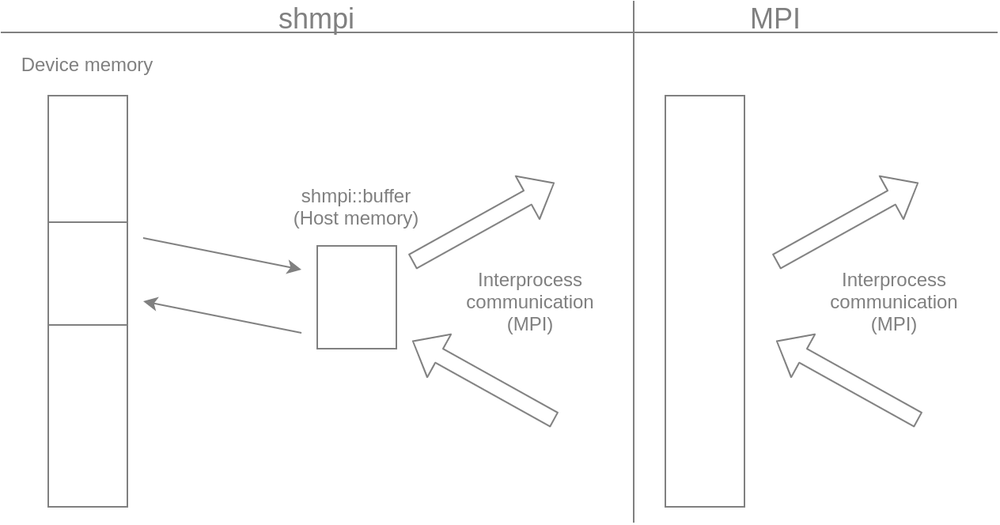

# Small Host MPI

This is a MPI wrapper framework for small host heterogeneous environment.



## Requirements
- MPI (We tests with Open MPI)
- C++ >= 11
- pthread

## Supported functions
- Send/Recv
- Sendrecv (only `send_count==recvcount` and `send_data_type==recv_data_type`)
- Allreduce (also `MPI_IN_PLACE`(`shmpi::shmpi_in_place`))

## Supported devices/platforms
- OpenCL

See 'Custom buffer' section.

## Installation and usage
1. Clone this repository
```
git clone https://github.com/enp1s0/shmpi
cd shmpi
```

2. Build
```
make
```

3. Write a code

See [test](./test) directory, for example.

4. Compile
```
g++ -I/path/to/shmpi/include -L/path/to/shmpi/lib -lshmpi ...
```

## Custom buffer
By defining a buffer class which inherits `shmpi::buffer`, you can easily use this framework on your device.
The buffer adopts **double buffering**, which uses double memory space to overlap device-host and node-node data transfer.
See [shmpi.hpp](./include/shmpi/shmpi.hpp), [cpu_buffer.hpp](./test/cpu_buffer.hpp) and [opencl_buffer.hpp](./include/shmpi/opencl_buffer.hpp) for example.

## License
MIT
